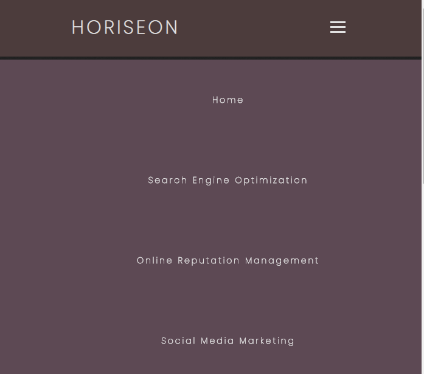
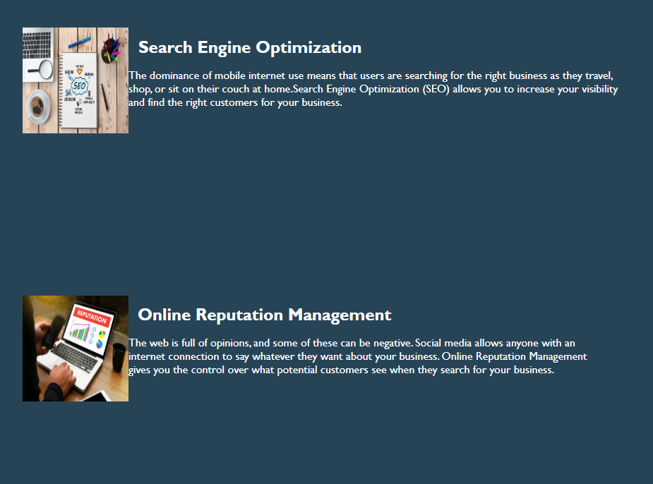
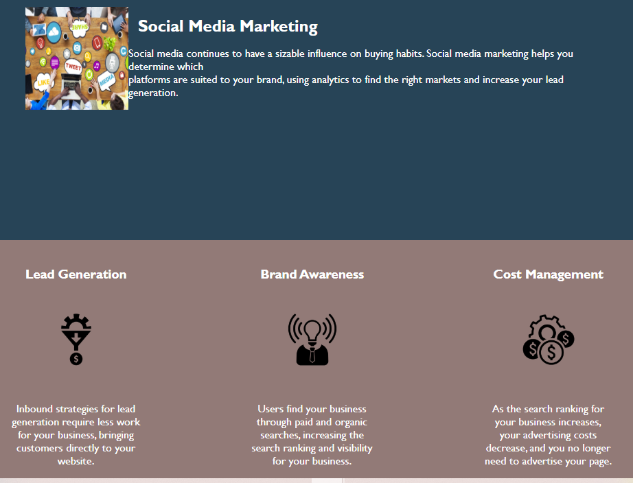

# Horiseon Accessibility Refactoring

Web accessibility is an increasingly important consideration for businesses,
ensuring that people with disabilities or socio-economic restrictions
have access to their website, and helping them avoid litigation.

This is how the page looks like when browser is resize

